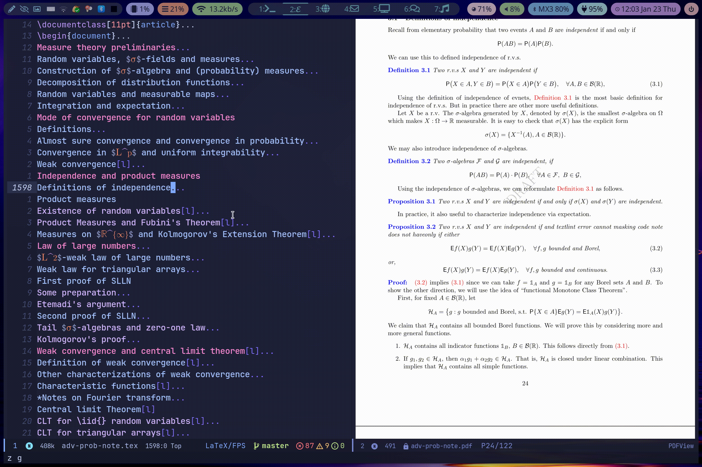
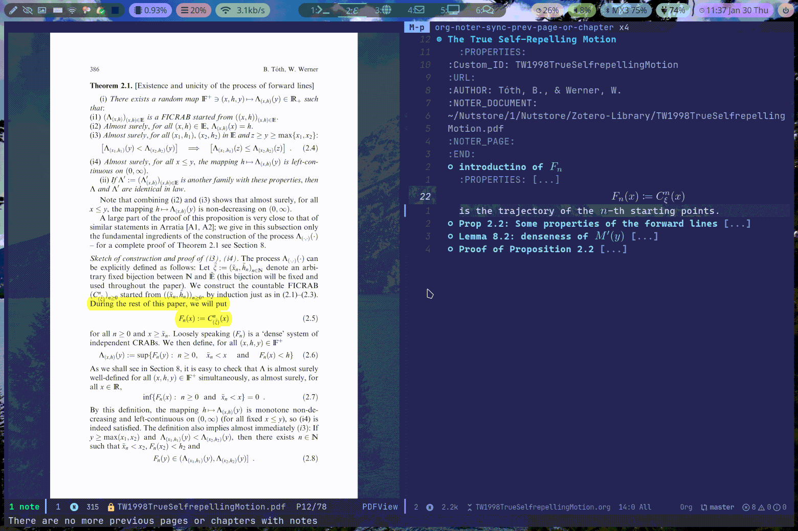
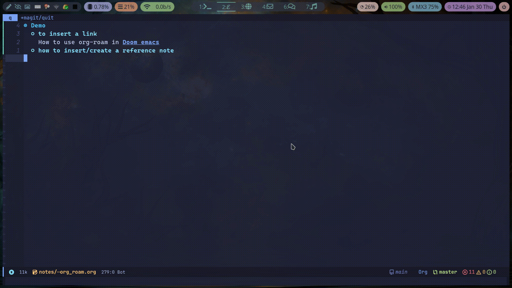

+++
title = "Scientific workflow in Emacs"
draft = false
showtoc = true
+++

> Vim is the editor God, and Emacs is God's editor.

I "live" in [Emacs](https://www.gnu.org/software/emacs/) everyday. I use it to

-   write LaTeX,
-   take notes,
-   read and annotate PDFs,
-   perform personal knowledge management ([Zettlekasten system](https://en.wikipedia.org/wiki/Zettelkasten)),
-   write codes (Python, Julia, ...),
-   build static sites (like this one),
-   read and send emails,
-   do GTD and time management,

and more.
For those who are looking for a more productive research workflow,
I hope that this article can be inspiring and introduce you to the Emacs's world of infinite possibilities.

## Life in Emacs {#life-in-emacs}

### LaTeX {#latex}

I started using Emacs as a LaTeX editor. One day I found myself capable of typing LaTeX fast enough to keep up with math lectures, and sine then, Emacs has been an indispensable part of my research workflow.

#### Overview {#overview}

The three packages AUCTeX, CDLaTeX and PDF-tools give Emacs the core functionality to write LaTeX.

-   The left part shows the LaTeX file and the right the compiled PDF (PDF-tools).
-   At startup, section contents are hidden to make it easier to navigate; you can unfold any section to start editing.
-   <kbd>C-c C-v</kbd> to jump from source to PDF (note the little red arrow and the highlighted text); double-click to jump from PDF to source.
-   Prettify: use Unicode symbols like `ℱ`, `∞` to show math macros like `\mathcal{F}`, `\infty`.
-   Fold LaTeX macros, so `\label{eq:XXX}`, `\cref{eq:XXX}` become `[l]`, `[cr]`.

I insert almost all macros using Emacs commands, so the invisible parts can stay error-free. See below.

#### Insert Macros Instantly {#insert-macros-instantly}

Use CDLaTeX to insert macros fast and accurately.

(Prettify is off in the screenshot.)

-   <kbd>\`+&lt;key&gt;</kbd> inserts Greek letters and symbols.
-   <kbd>&lt;keyword&gt;+TAB</kbd> expands to a macro or an environment template. Example:
    -   <kbd>equ*+TAB</kbd> inserts the `equation*` environment.
    -   <kbd>fr+TAB</kbd> expands to `\frac{}{}`.
-   <kbd>&lt;key&gt;+'</kbd> or <kbd>'+&lt;key&gt;</kbd> inserts modified letters. Example: <kbd>R'c</kbd> inserts `\mathcal{R}`.

All these shortcuts are highly customizable.

#### Cross Reference {#cross-reference}

A convenient cross-reference management brings the freedom of creating literate labels.

(TeX-fold is off in the screenshot.)
In the screenshot:

-   <kbd>ref+TAB</kbd> to start the RefTeX interface,
-   select the type `p` for "proposition",
-   navigate through all the `prop:` labels, view the context, and choose the correct label.

No more copy-and-paste.

### Note Taking and Knowledge Management {#note-taking-and-knowledge-management}

The traditional note is linear. I used to put all my notes in a single TeX, Org or Markdown file. But often as the note file  grew larger, it became harder to retrieve and analyze information. I also dreamed of integrating the reference manager [Zotero](https://www.zotero.org/) with Emacs, so I can connect the notes to the literature.

These were made possible by [Org-roam](https://www.orgroam.com/), a modern note system built upon Org mode in Emacs. During the COVID pandemic, a number of modern back-linked note systems (aka "person knowledge management" or "second brain") emerged, including [Roam Research](https://roamresearch.com/), [Obsedian](https://obsidian.md/), [Logseq](https://logseq.com/) and so on. Org-roam gets its name from Roam Research, which is the first such implementation.

#### What is PKM? {#what-is-pkm}

PKM (personal knowledge management) follows the principles of the [Zettlekasten system](https://en.wikipedia.org/wiki/Zettelkasten).
The first principle is to store knowledge inside a network of notes, rather than a traditional linear system.

(My Org-roam notes in 2 years.)

Using the package ORUI, you can visualize the network of notes and preview the content.

#### Notes in Org Mode {#notes-in-org-mode}

I use `.org` files to store notes in Emacs. Org is a markup language like Markdown, and it has first class LaTeX support.

-   Use the built-in `org-cdlatex-mode` to enter math.
-   Preview the formula in place with `org-latex-preview`.

With a little more configuration, taking notes in Org mode is as good as in a TeX file, but more flexible and powerful. The Org mode can do A LOT in Emacs!

#### Links {#links}

-   Use a completion interface to fuzzy search and insert a (forward) link.
-   The `org-roam-buffer` (on the right) keeps tracks of all the back-links and gives preview.

### Reference Management {#reference-management}

#### Read PDFs in Emacs {#read-pdfs-in-emacs}

I use [Org Noter](https://github.com/weirdNox/org-noter) to make notes on PDF in Org files. Its key feature is syncing the headlines with their locations in the PDF.

An Org Noter session have two dedicated buffers:

-   a PDF-tools buffer (left) to display the PDF,
-   a Org buffer (right) to write notes.

#### Create Noter notes from Zotero Metadata {#create-noter-notes-from-zotero-metadata}

## Learning and configuration {#learning-and-configuration}
